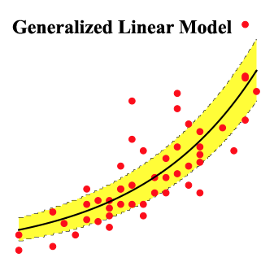

# Generalized Linear Model implementation in Java

Package implements the generalized linear model in Java

[](https://travis-ci.org/chen0040/java-glm) [](https://coveralls.io/github/chen0040/java-glm?branch=master) 



# Features

The current implementation of GLM supports as many distribution families as glm package in R:

* Normal
* Exponential
* Gamma
* InverseGaussian
* Poisson
* Bernouli
* Binomial
* Categorical
* Multinomial

For the solvers, the current implementation of GLM supports a number of variants of the iteratively re-weighted least squares estimation algorithm:
 
* IRLS
* IRLS with QR factorization
* IRLS with SVD factorization

# Usage

## Step 1. Create a data frame

Suppose you have a csv file named contraception.csv that has the following file format:

```
"","woman","district","use","livch","age","urban"
"1","1","1","N","3+",18.44,"Y"
"2","2","1","N","0",-5.5599,"Y"
"3","3","1","N","2",1.44,"Y"
"4","4","1","N","3+",8.44,"Y"
"5","5","1","N","0",-13.559,"Y"
"6","6","1","N","0",-11.56,"Y"
```

An example of java code to create a data frame from the above CSV file:

```java
import com.github.chen0040.glm.data.DataFrame;
import com.github.chen0040.glm.data.DataQuery;
import com.github.chen0040.glm.utils.StringUtils;

int column_use = 3;
int column_livch = 4;
int column_age = 5;
int column_urban = 6;
boolean skipFirstLine = true;
String columnSplitter = ",";
InputStream inputStream = new FileInputStream("contraception.csv");
DataFrame frame = DataQuery.csv(columnSplitter, skipFirstLine)
        .from(inputStream)
        .selectColumn(column_livch).transform(cell -> cell.equals("1") ? 1.0 : 0.0).asInput("livch1")
        .selectColumn(column_livch).transform(cell -> cell.equals("2") ? 1.0 : 0.0).asInput("livch2")
        .selectColumn(column_livch).transform(cell -> cell.equals("3+") ? 1.0 : 0.0).asInput("livch3")
        .selectColumn(column_age).asInput("age")
        .selectColumn(column_age).transform(cell -> Math.pow(StringUtils.parseDouble(cell), 2)).asInput("age^2")
        .selectColumn(column_urban).transform(cell -> cell.equals("Y") ? 1.0 : 0.0).asInput("urban")
        .selectColumn(column_use).transform(cell -> cell.equals("Y") ? 1.0 : 0.0).asOutput("use")
        .build();
```

The code above create a data frame which has the following columns

* livch1 (input): value = 1 if the "livch" column of the CSV contains value 1 ; 0 otherwise
* livch2 (input): value = 1 if the "livch" column of the CSV contains value 2 ; 0 otherwise
* livch3 (input): value = 1 if the "livch" column of the CSV contains value 3+ ; 0 otherwise
* age (input): value = numeric value in the "age" column of the CSV
* age^2 (input): value = square of numeric value in the "age" column of the CSV
* urban (input): value = 1 if the "urban" column of the CSV has value "Y" ; 0 otherwise
* use (output): value = 1 if the "use" column of the CSV has value "Y" ; 0 otherwise

(Currently csv files and the libsvm format are supported for creating data frame, more option will be added in the future) 

## Step 2: Create and train the glm against the data frame
 
Suppose you want to create logistic regression model from GLM and train the logistic regression model against the data frame 

```java
import com.github.chen0040.glm.solvers.Glm;
import com.github.chen0040.glm.enums.GlmSolverType;

Glm glm = Glm.logistic();
glm.setSolverType(GlmSolverType.GlmIrls);
glm.fit(frame);
```

The line "Glm.logistic()" create the logistic regression model, which can be easily changed to create other regression models (For example, calling "Glm.linear()" create a linear regression model) 

The line "glm.fit(..)" performs the GLM training.

## Step 3: Use the trained glm to perform regression on data

To run the trained glm against the test data, load the testing data into another data frame:

```java
InputStream inputStream = new FileInputStream("contraception-validation.csv");
DataFrame testingData = DataQuery.csv(columnSplitter, skipFirstLine)
        .from(inputStream)
        .selectColumn(column_livch).transform(cell -> cell.equals("1") ? 1.0 : 0.0).asInput("livch1")
        .selectColumn(column_livch).transform(cell -> cell.equals("2") ? 1.0 : 0.0).asInput("livch2")
        .selectColumn(column_livch).transform(cell -> cell.equals("3+") ? 1.0 : 0.0).asInput("livch3")
        .selectColumn(column_age).asInput("age")
        .selectColumn(column_age).transform(cell -> Math.pow(StringUtils.parseDouble(cell), 2)).asInput("age^2")
        .selectColumn(column_urban).transform(cell -> cell.equals("Y") ? 1.0 : 0.0).asInput("urban")
        .selectColumn(column_use).transform(cell -> cell.equals("Y") ? 1.0 : 0.0).asOutput("use")
        .build();
```

The trained glm can then run on the testing data, below is a java code example for logistic regression:

```java
for(int i = 0; i < testingData.rowCount(); ++i){
    boolean predicted = glm.transform(testingData.row(i)) > 0.5;
    boolean actual = frame.row(i).target() > 0.5;
    System.out.println("predicted(Irls): " + predicted + "\texpected: " + actual);
}
```

The line "glm.transform(..)" perform the regression 


# Background on GLM 

## Introduction

GLM is generalized linear model for exponential family of distribution model b = g(a).
g(a) is the inverse link function.

Therefore, for a regressions characterized by inverse link function g(a), the regressions problem be formulated
as we are looking for model coefficient set x in

```math
g(A * x) = b + e
```

And the objective is to find x such for the following objective:

```math
min (g(A * x) - b).transpose * W * (g(A * x) - b)
```


Suppose we assumes that e consist of uncorrelated naive variables with identical variance, then W = sigma^(-2) * I,
and The objective 

```math
min (g(A * x) - b) * W * (g(A * x) - b).transpose
```
 
is reduced to the OLS form:

```math
min || g(A * x) - b ||^2
```


## Iteratively Re-weighted Least Squares estimation (IRLS)

In regressions, we tried to find a set of model coefficient such for:

```math
A * x = b + e
```


A * x is known as the model matrix, b as the response vector, e is the error terms.

In OLS (Ordinary Least Square), we assumes that the variance-covariance 

```math
matrix V(e) = sigma^2 * W
```

, where:
  W is a symmetric positive definite matrix, and is a diagonal matrix
  sigma is the standard error of e

In OLS (Ordinary Least Square), the objective is to find x_bar such that e.transpose * W * e is minimized (Note that since W is positive definite, e * W * e is alway positive)
In other words, we are looking for x_bar such as (A * x_bar - b).transpose * W * (A * x_bar - b) is minimized

Let 

```math
y = (A * x - b).transpose * W * (A * x - b)
```

Now differentiating y with respect to x, we have

```math
dy / dx = A.transpose * W * (A * x - b) * 2
```


To find min y, set dy / dx = 0 at x = x_bar, we have

```math
A.transpose * W * (A * x_bar - b) = 0
```

Transform this, we have

```math
A.transpose * W * A * x_bar = A.transpose * W * b
```


Multiply both side by (A.transpose * W * A).inverse, we have

```math
x_bar = (A.transpose * W * A).inverse * A.transpose * W * b
```

This is commonly solved using IRLS

The implementation of Glm based on iteratively re-weighted least squares estimation (IRLS)

